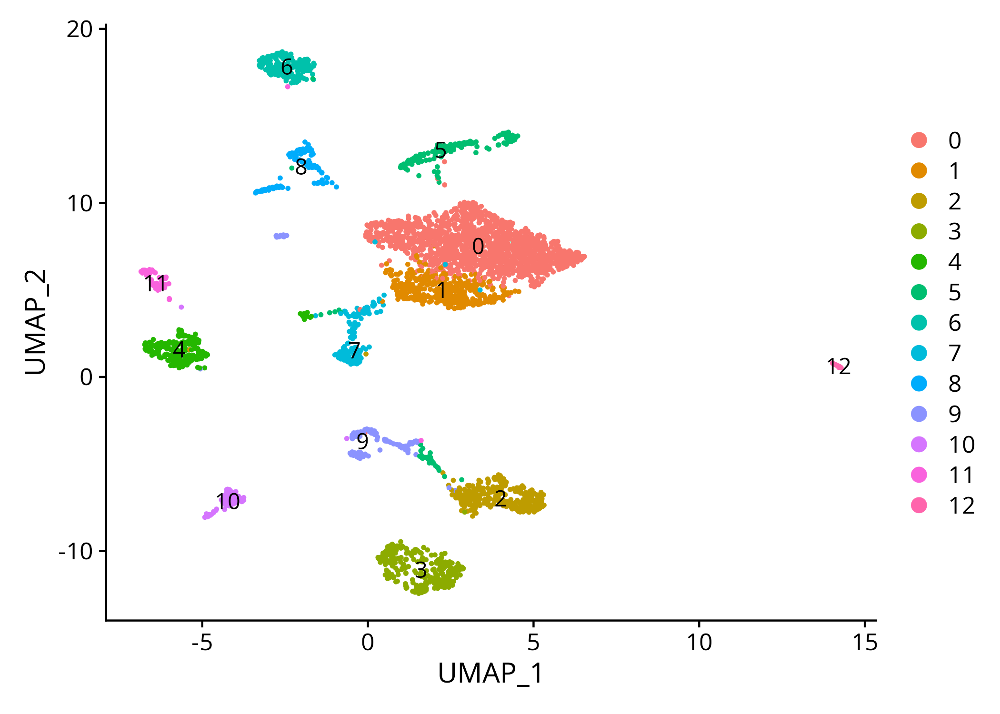
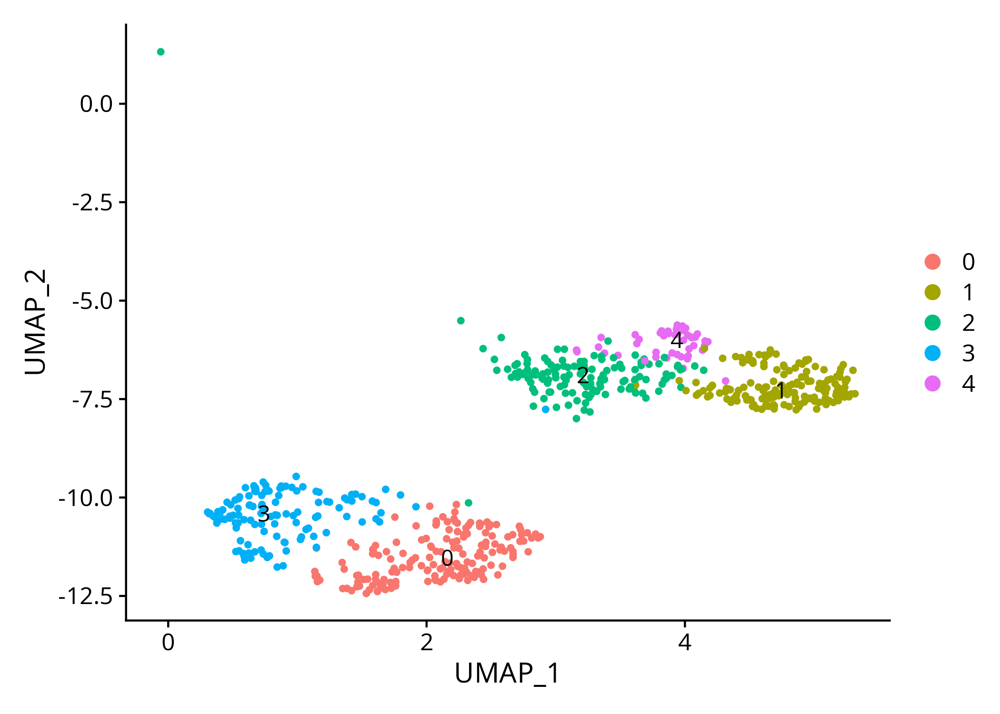
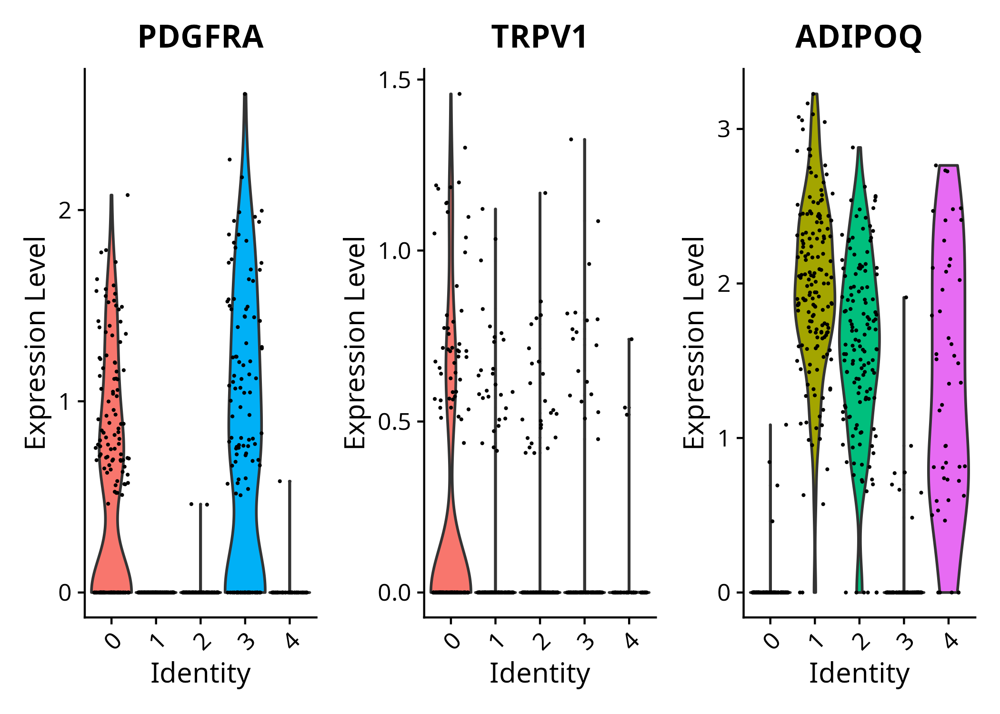

# Replication: snRNA-seq analysis of human neck fat (Shamsi et al. 2021)

Independent replication of the single-nuclei RNA-seq (snRNA-seq) analysis
pipeline from:

> Shamsi, F., Piper, M., Ho, L.L. et al. Vascular smooth muscle-derived Trpv1+
> progenitors are a source of cold-induced thermogenic adipocytes. *Nat Metab*
> 3, 485–495 (2021). https://doi.org/10.1038/s42255-021-00373-z

using the publicly available data used by the authors on ArrayExpress
(accession **E-MTAB-8564**). The original study profiled human neck fat to
characterize adipocyte and adipocyte progenitor (APC) populations, and
identified TRPV1+ vascular smooth muscle-derived progenitors as a source of
cold-induced thermogenic adipocytes.

This repository documents a from-scratch reimplementation of the paper's QC,
batch integration, and clustering pipeline (DropletUtils → scVI/Scanpy →
Seurat), built to develop hands-on experience with modern snRNA-seq workflow.

## Contents

- [Data](#data)
- [Pipeline overview](#pipeline-overview)
- [Repository structure](#repository-structure)
- [Environment / reproducibility](#environment--reproducibility)
- [Key results](#key-results)
- [Comparison with the original paper](#comparison-with-the-original-paper)
- [Limitations and notes](#limitations-and-notes)

## Data

- **Source**: [ArrayExpress E-MTAB-8564](https://www.ebi.ac.uk/biostudies/arrayexpress/studies/E-MTAB-8564)
- **Samples**: 9 CellRanger output folders (`H_BAT_F_1`, `H_BAT_F_5`,
  `H_BAT_F_6`, `H_BAT_F_7`, `H_BAT_F_8`, `H_BAT_nF_1`, `H_BAT_nF_2`,
  `H_BAT_nF_3`, `H_BAT_nF_4`) from human neck (brown/beige) fat
- **Not included in this repo**: raw CellRanger outputs are not committed
  (public data, large file sizes). See `data/README.md` for download
  instructions to regenerate the inputs.

## Pipeline overview

| Step | Script | Tool | Key operation | Output |
| 1 | [`scripts/01_qc_filtering_h5ad_export.R`](scripts/01_qc_filtering_h5ad_export.R) | R — DropletUtils, sceasy | Read 10x counts, barcode rank QC per sample (`barcodeRanks`), select the 4 `nF` samples that passed, keep top 1,000 barcodes by UMI, remove doublets (UMI > 20,000), export each sample to `.h5ad` via `sceasy::convertFormat()` | 4 per-sample `.h5ad` files |
| 2 | [`scripts/02_scvi_integration_umap.ipynb`](scripts/02_scvi_integration_umap.ipynb) | Python — Scanpy, scvi-tools | `ad.concat()` with `label="batch_indices"`, switch var_names to gene symbols, filter genes in <3 nuclei, select top 2,000 HVGs (`flavor="cell_ranger"`), integrate with `scvi.model.SCVI` (n_latent=20, gene_likelihood="nb", max_epochs=400, lr=1e-3), `sc.pp.neighbors` on `X_scVI`, `sc.tl.umap` | One integrated `.h5ad` (`H_BAT_nF_integrated.h5ad`) with latent space + UMAP |
| 3 | [`scripts/03_seurat_clustering_marker_id.R`](scripts/03_seurat_clustering_marker_id.R) | R — Seurat, sceasy | Convert integrated `.h5ad` to a Seurat object via `sceasy::convertFormat()`, normalize/scale, `FindNeighbors` on the `scVI` reduction (20 dims), `FindClusters` (res=0.5), `FindAllMarkers`, identify adipocyte (ADIPOQ+, cluster 2) and APC (PDGFRA+, cluster 3) clusters, subset and recluster (res=0.8) | Annotated Seurat object, marker CSVs, UMAP/feature/violin plots |


## Repository structure

```
snRNAseq-neck-fat-replication/
├── README.md
├── LICENSE
├── environment/
│   ├── environment.yml          # conda env for Python (Scanpy, scvi-tools, sceasy)
│   └── session_info.txt         # R package versions (DropletUtils, Seurat, sceasy)
├── data/
│   └── README.md                # E-MTAB-8564 download instructions
├── scripts/
│   ├── 01_qc_filtering_h5ad_export.R
│   ├── 02_scvi_integration_umap.ipynb
│   └── 03_seurat_clustering_marker_id.R
├── figures/
│   ├── barcode_rank_plots/      # Barcode_rank_plot_<sample>.png, all 9 samples
│   ├── umap_clusters/           # UMAP1.png, umap2.png
│   ├── marker_dotplots/         # markerplot1.png, markerplot2.png, violinplot*.png
│   └── README.md                # maps each figure to its generating script
├── results/
│   ├── H_BAT_cluster_markers.csv
│   └── H_BAT_subset_markers.csv
└── docs/
    └── methodology.md           # detailed methods write-up with parameter rationale
```

## Environment / reproducibility

**Python** (script 02):
```bash
conda env create -f environment/environment.yml
conda activate sc
```
Key packages: `scanpy`, `scvi-tools`, `anndata`, `torch` (GPU-enabled training
was used: `accelerator="gpu", devices=1`).

**R** (scripts 01, 03):
Package versions used are recorded in `environment/session_info.txt`
(generated via `sessionInfo()`). Key packages: `DropletUtils`, `ggplot2`,
`sceasy` (handles both the R→Python and Python→R handoffs), `Seurat`,
`reticulate`, `dplyr`.

Script 03 uses `reticulate::use_condaenv()` to point R at the same conda
environment used in script 02 — both scripts must share one environment for
`sceasy` conversions to work correctly.

To reproduce the full analysis, run the three steps in order (01 → 02 → 03),
pointing each script at the output of the previous one as described in each
script's header. Update the hardcoded `base_dir` / file paths in each script
to match your local setup before running.

## Key results



Clusters 2 (ADIPOQ+, adipocytes) and 3 (PDGFRA+, adipocyte progenitor cells / APCs) were identified via feature and violin plots and subsetted for reclustering.*



Clustering of adipocytes and adipocyte progenitor cells after subsetting.



Violin plot identifying cluster 0 as the TRPV1+ adipocyte progenitor cell population.

## Comparison with the original paper

- Samples passing QC: 4 of 9 (`H_BAT_nF_1–4`) were retained, matching the paper's
  reported sample set based on barcode rank inflection points.
- Recovered the same number of clusters as the paper from the adipocyte and adipocyte progenitor cell subset.
- I could observe that ADIPOQ+ and PDGFRA+ clusters correspond in relative size/position
  to those reported in the paper.
- I was able to resolve a distinct TRPV1+ subpopulation of adipocyte progenitor cells (Cluster0) as reported in the paper.

## Limitations and notes

- **scVI API version**: this replication uses the current `scvi-tools` API
  (`scvi.model.SCVI.setup_anndata()` + `model.train()`), not the legacy
  `VAE`/`UnsupervisedTrainer` classes that may have been available at the
  time of the original paper. Parameters were mapped directly:
  `n_epochs` → `max_epochs=400`, `lr` → `plan_kwargs={"lr": 1e-3}`,
  `reconstruction_loss="nb"` → `gene_likelihood="nb"`, `use_batches=True` →
  handled via `batch_key="batch_indices"` in `setup_anndata()`, `n_latent=20`
  unchanged.
- **HVG selection**: `sc.pp.highly_variable_genes(..., flavor="cell_ranger")`
  was used for the top 2,000 HVG selection, corresponding to the paper's
  `subsample_genes` step (a scVI-adjacent helper not present in current
  releases).
- **Additional filtering not explicit in the original methods paragraph**:
  genes expressed in fewer than 3 nuclei were filtered
  (`sc.pp.filter_genes(min_cells=3)`) before HVG selection — this is common
  practice but wasn't explicitly stated in the paper's methods text, so is
  noted here as an added step.
- **R↔Python handoff**: both conversions (sce→`.h5ad` in script 01, `.h5ad`→
  Seurat in script 03) use `sceasy::convertFormat()`. This requires the R
  session to be pointed at the same conda environment as the Python
  notebook (via `reticulate::use_condaenv()`) for script 3 due to dependency issues.
- **Gene identifiers**: switched from Ensembl IDs to gene symbols
  (`adata.var["Symbol"]`) after concatenation, with `var_names_make_unique()`
  applied to handle duplicate symbols.
- All hardcoded local paths (`/home/abhi/sc`, `/home/abhi/miniconda3/...`)
  need to be updated for reproduction on another machine.

## Citation

If referencing this replication, please cite the original paper:

> Shamsi, F., Piper, M., Ho, L.L. et al. Vascular smooth muscle-derived
> Trpv1+ progenitors are a source of cold-induced thermogenic adipocytes.
> *Nat Metab* 3, 485–495 (2021). https://doi.org/10.1038/s42255-021-00373-z

## License

[MIT License — see LICENSE]
